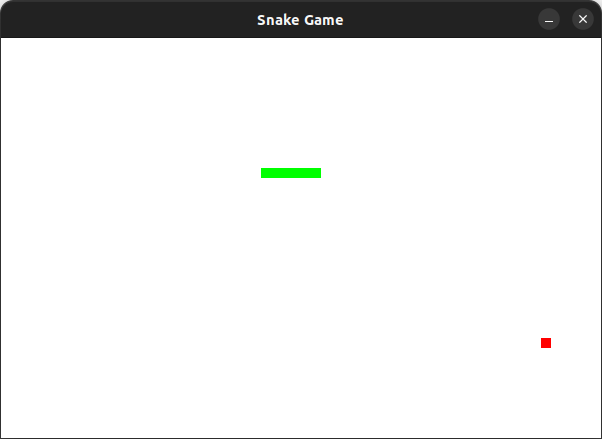

## Projet

It's a snake game that everyone knows. I decided to create this because it's one of the first games I played as a child, and I decided to share it. 

For the moment this is the first version, there will probably be future versions with improved graphics, functionality...

The principle is simple: you have to eat the red dot to make the green snake grow as much as possible. 




## Requirements

Python

Pygame


## Usage

``` git clone https://github.com/Kami-404/Snake-Game.git ```

``` cd Snake-Game ```

``` python3 main.py ```


## Thank you for using this project!

I simply made this project for fun. I hope you found it useful and that it meets your needs.